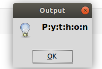

# Pyout

Pyout script helps you see code output in dialog.

## Features

* Open Source
* Helps you run python2 code and see output in dialog.

## Installation and Usage

1. [Python2](https://www.python.org/downloads/) required
2. [Tkinter](https://wiki.python.org/moin/TkInter) required
```
    sudo apt install python-tk
```
3. [Pyperclip](https://pyperclip.readthedocs.io/en/latest/introduction.html) required
```
    pip install pyperclip
```
4. Copy python2 code you want to run.

5. Download script and use keyboard shortcut to run the script.

## How can it helps?
When using keyboard shortcut to run the script, it is lot easier and help learn python tutorial from website, book etc.

Example: 
Copy python code.
```
Ctrl + c
```
Run the script to see output.
```
Ctrl + Shift + x 
```

## Screenshot




## Suggestions
Open to any suggestions and help provided.